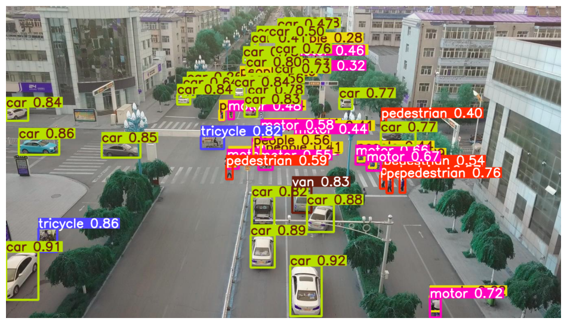

# VisDrone-OD: High-Performance Drone Object Detection

This repository implements a modular object detection system for drone-captured imagery using the **YOLOv11s** architecture. Designed specifically for the [VisDrone Dataset](https://github.com/VisDrone/VisDrone-Dataset), it provides a complete pipeline from data extraction to batch inference.



## Overview
Drone-based surveillance requires robust detection that can handle high-density scenes and small targets from aerial perspectives. This project automates the workflow for the 2019 VisDrone Detection (DET) competition data, optimizing it for both high-end and local environments.

### Key Features
- **YOLOv11 Architecture**: Leverages the latest YOLO version for improved mAP and speed.
- **Cross-Platform Compatibility**: Enhanced `data_prep.py` with `shutil` supports Windows, Linux, and MacOS out-of-the-box.
- **Robust Parsing**: Advanced annotation conversion handles decimal coordinates and prevents script crashes common with non-standard labeling.
- **Modular Codebase**: Decoupled scripts for preparation, training, and inference for better experiment tracking.

## Dataset & Classes
The system maps VisDrone categories (1-10) to 10 distinct YOLO classes:
1. **pedestrian**  2. **people**  3. **bicycle**  4. **car**  5. **van**
6. **truck**  7. **tricycle**  8. **awning-tricycle**  9. **bus**  10. **motor**

*Note: Categories 0 (ignored) and 11 (others) are excluded during training.*

## Project Structure
```text
├── config.yaml                 # YOLO dataset definition (paths, names, classes)
├── requirements.txt            # Python dependencies
├── .gitignore                  # Ignoring datasets, checkpoints, and logs
├── assets/                     # Training results, confusion matrices, and previews
├── src/                        # Implementation Source
│   ├── data_prep.py            # Kaggle download, unzipping, and YOLO formatting
│   ├── train.py                # Model training (imgsz: 768, batch: 16)
│   └── inference.py            # Batch image prediction and CSV report generation
└── notebooks/                  # Experimental notebooks (Legacy research)
```

## Quick Start
### 1. Requirements
```bash
pip install -r requirements.txt
```

### 2. Data Preparation
Set your Kaggle API credentials and run:
```bash
python src/data_prep.py
```
*The script handles zip extraction and converts annotations from the VisDrone format to the normalized YOLO format.*

### 3. Training
```bash
python src/train.py
```
*Standard training uses YOLOv11s with an image size of 768x768 and a batch size of 16.*

### 4. Inference
```bash
python src/inference.py --model path/to/best.pt --input data/VisDrone2019-DET-val/images --output results.csv
```

## Results Evaluation
Check the `assets/` directory for:
- `confusion_matrix.png`: Model classification accuracy per class.
- `BoxPR_curve.png`: Precision-Recall performance.
- `val_batch_pred.jpg`: Visual validation of detector predictions.
